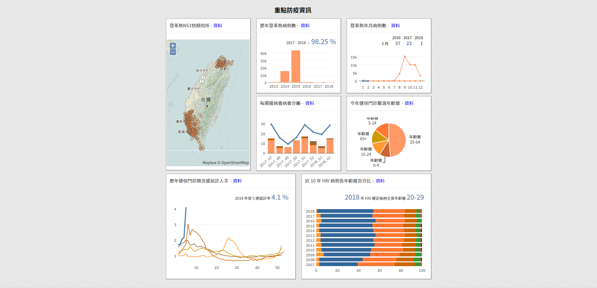
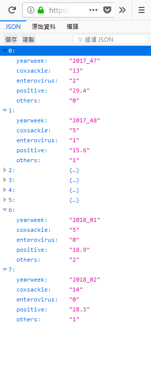

## Taiwan CDC Open Data Visualization API


The repository is the API for the visualization charts on Taiwan CDC open data portal (the following image). The visualization api consists of two types, php-mysql-based and nodejs-redis-based ones. The php-mysql-based api is accessed over http/https on port 80/443. The nodejs-redis-based api is accessed over http/https on port 8080/8080. The php-mysql-based api is directly accessing the mysql database which is updated by a task scheduler generating the data ([jiankaiwang/tcdc_opendata_visualization_data](https://github.com/jiankaiwang/tcdc_opendata_visualization_data)).

All the api is designed as the **GET** operation and the content type is **application/json**.




## Step

* Git clone the repository.

```shell
$ git clone https://github.com/jiankaiwang/tcdc_opendataapi_php.git
```

* Edit the **config.php** and fill the mysql configuration.

```php
<?php
$mysqlhost = 'localhost';
$mysqlport = 3306;
$mysqluser = 'user';
$mysqlpass = 'password';
$mysqldb = 'dbname';
?>
```

* Move the whole folder to the server (e.g. apache or nginx, etc.).

```shell
# take apache server as the example
sudo mv /path/tcdc_opendataapi_php /var/www/html/opendataplatform
```

* [optional] Secure the api (take Let's encrypt as the example).

```shell
$ sudo apt-get -s update
$ sudo apt-get install python-letsencrypt-apache
$ sudo letsencrypt --apache -d example.com
```

* Surf the link.

```http
<!-- all api is designed as the GET operation -->

<!-- dengue open data api -->
GET http(s)://example.com/opendataplatform/?s=dengue&v=a1
GET http(s)://example.com/opendataplatform/?s=dengue&v=a2

<!-- enterovirus open data api -->
GET http(s)://example.com/opendataplatform/?s=enterovirus&v=a1

<!-- diarrhea open data api -->
GET http(s)://example.com/opendataplatform/?s=diarrheapiechart&v=a1

<!-- influ open data api -->
GET http(s)://example.com/opendataplatform/?s=influlinechart&v=a1

<!-- hiv open data api -->
GET http(s)://example.com/opendataplatform/?s=hivbc&v=a1
```


## API Example

```http
<!-- enterovirus open data api -->
GET http(s)://example.com/opendataplatform/?s=enterovirus&v=a1
```


